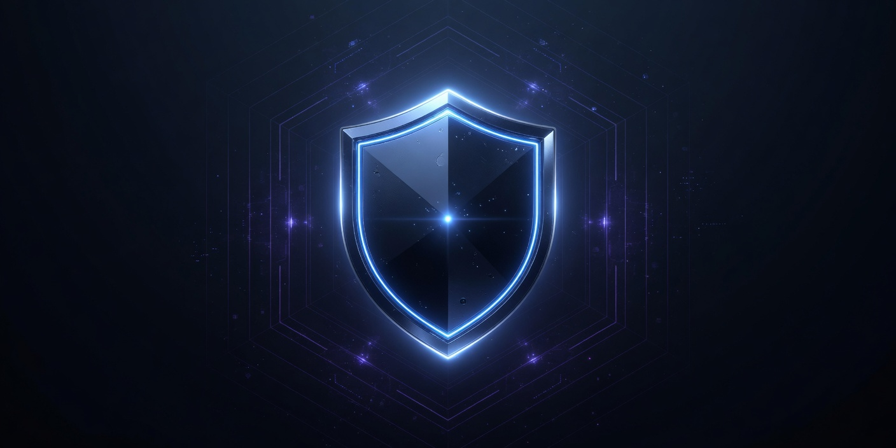

<p align="center">
  
</p>

<p align="center">
  
</p>

<p align="center">
  
</p>

<p align="center">
  <strong>secureblue’s hardening. Recommended: stock Trivalent plus extra locks.<br>Or Brave Origin, or no browser. Terminal, no curator store.</strong>
</p>

<p align="center">
  <a href="https://sergi270710267.github.io/unwoke-secureblue/"></a>
  <a href="https://github.com/SeRgi270710267/unwoke-secureblue/actions/workflows/build.yml"></a>
  <a href="https://github.com/SeRgi270710267/unwoke-secureblue/pkgs/container/unwoke-silverblue-trivalent"></a>
  <a href="LICENSE"></a>
</p>

<p align="center">
  <a href="https://sergi270710267.github.io/unwoke-secureblue/install/">Install</a>
  · <a href="https://sergi270710267.github.io/unwoke-secureblue/features/">Features</a>
  · <a href="https://sergi270710267.github.io/unwoke-secureblue/privacy/">Privacy</a>
  · <a href="https://sergi270710267.github.io/unwoke-secureblue/compared/">Compared</a>
  · <a href="https://sergi270710267.github.io/unwoke-secureblue/brand/">Brand</a>
  · <a href="https://sergi270710267.github.io/unwoke-secureblue/changelog/">Changelog</a>
</p>

<p align="center">
  
</p>

> **Not affiliated with secureblue.** Overlay on their signed Fedora Atomic images. **Not a fork.** Their kernel hardening, `hardened_malloc`, SELinux, no Xwayland by default, and automatic updates stay.

The product name is **Unwoke SecureBlue**. *Unwoke* is the modifier. *SecureBlue* is one word (S and B capped) — not “Secure Blue”, not `unwoke-secureblue` in titles. Git and GHCR stay lowercase (`unwoke-secureblue`, `unwoke-silverblue`) because registries and rebase commands are slugs.

We strip **Bazaar** and GUI stores on every image.

| | **Trivalent** `*-trivalent` | **Origin** (unsuffixed) | **Browserless** `*-browserless` |
| --- | --- | --- | --- |
| | **Recommended default** | Named choice | Named choice |
| Browser | Stock [Trivalent](https://github.com/secureblue/Trivalent) jail + extra reversible Chromium policies | [Brave Origin](https://brave.com/origin/linux/) RPM in `brave_t` (looser SELinux) | None. Seatbelt until `ujust set-allow-browsers on ALLOW` |
| Store | None | None | None |
| Userns | Stock (Flatpak + Trivalent) | Stock + `brave_t` allow-list | Stock with Trivalent gone |

`*-trivalent` equals stock on the house browser and is stricter on extra Chromium policies + house locks. Extra JSON is not a new compiler patch. `brave_t` is **not** Trivalent’s tight confinement.

---

## Install

Already on secureblue (or any Fedora Atomic). First switch cannot check our stamp yet. After reboot, first-boot queues the **signed** image — reboot once more when `rpm-ostree status` shows it staged.

```bash
rpm-ostree rebase ostree-unverified-registry:ghcr.io/sergi270710267/unwoke-silverblue-trivalent:latest
systemctl reboot
```

If it did not auto-stage (no network on first boot):

```bash
rpm-ostree rebase ostree-image-signed:docker://ghcr.io/sergi270710267/unwoke-silverblue-trivalent:latest
systemctl reboot
```

```bash
cosign verify --key cosign.pub ghcr.io/sergi270710267/unwoke-silverblue-trivalent
```

KDE → `unwoke-kinoite-trivalent`. NVIDIA → add `-nvidia-open` before `-trivalent`. Brave Origin → drop `-trivalent`. No browser → `-browserless`.

Empty disk: flash a USB from [Actions](https://github.com/SeRgi270710267/unwoke-secureblue/actions/workflows/iso.yml) (artifact, GitHub login) or a [secureblue ISO](https://secureblue.dev/install) then rebase. Encrypt, wheel, enroll **their** Secure Boot key. Not Ventoy.

After first graphical login: **Unwoke setup** (`ujust setup`). `ujust why` if something looks broken. Nothing unlocks unless you pick it. Everyday tasks: [Tutorials](https://sergi270710267.github.io/unwoke-secureblue/tutorials/). Proton.me: `ujust install-proton`. IVPN: `ujust install-ivpn`. Mullvad: `ujust install-mullvad`.

Published as `ghcr.io/sergi270710267/<name>:latest`. OS images are **public**. No GitHub login to pull.

Current bake **receipt** (pubkey + verified digests, not the OS, not a USB): [Releases / receipt](https://github.com/SeRgi270710267/unwoke-secureblue/releases/tag/receipt). Ignore the source zip GitHub adds. The factory rewrites that tag; it does not attach the ISO.

---

## Why this exists (receipts, not vibes)

Stock secureblue is a serious hardened Fedora Atomic. It also ships a house browser and a house app store that decide what you may install.

| | Stock [secureblue](https://secureblue.dev) | Origin | Trivalent | Browserless |
| --- | --- | --- | --- | --- |
| Browser | Trivalent — their Chromium, SELinux-confined | Brave Origin standalone RPM. Runs in `brave_t` | Stock Trivalent + extra reversible policies | None |
| App store | [Bazaar](https://github.com/secureblue/bazaar-rpm) | **None.** Flathub off until `ujust set-flathub verified` | **None.** Same | **None.** Same |
| User namespaces | Off for unconfined; on for Flatpak and Trivalent | Same, plus `brave_t` on their userns allow-list | Same as stock. No `brave_t` | Unconfined blocked, Flatpak allowed, no extra domain |

Browserless is safer than Origin **until you install a browser**. Easy host installs are blocked until `ujust set-allow-browsers on ALLOW` (Flatpak mask + rpm-ostree exclude). Seatbelt only: toolbox, brew, AppImage, and `rpm-ostree --disableexcludes` still work.

Stock `ujust` still works (`ujust set-unconfined-userns`, `ujust set-kargs-hardening`, `ujust audit-secureblue`, …). We did **not** gut SELinux, kernel args, `hardened_malloc`, disk encryption, or Secure Boot enrollment.

<details>
<summary><strong>Overlay ujust extras</strong></summary>

```bash
ujust unwoke-status
ujust audit-unwoke
ujust setup
ujust why

# Origin and Trivalent (restart the browser after policy changes)
ujust set-brave-hardening on|off     # HTTPS, no metrics, no autofill/passwords (default on)
ujust set-brave-devices on|off       # camera/mic/geo/USB/BT/serial blocked (default on)
ujust set-brave-jitless on|off       # no JS JIT; breaks some sites (default on)
ujust set-brave-extensions block|allow
ujust set-brave-isolation on|off     # no WebGL/WebGPU; SitePerProcess (default on)
ujust set-brave-sandbox on|off       # audio sandbox, no screen capture, no JS optimizer
ujust set-brave-devtools lock|allow  # default allow (opt-in)
ujust set-brave-bubblejail on|off    # Origin only; default on; GPU may break
ujust set-trivalent-network-sandbox on|off  # Trivalent only; may clear cookies
ujust set-trivalent-referrers on|off        # Trivalent only; punycode + strip referrers

# All flavors
ujust set-flathub verified|full|off  # default off; verified = stock
ujust set-bluetooth on|off           # default off; Wi-Fi stays
ujust set-toolbox on|off             # default off; /usr/bin/toolbox is a wrapper
ujust set-extra-daemons on|off       # default off (Avahi + ModemManager)
ujust set-stock-nags on|off          # default off
ujust set-flatpak-lockdown on|off    # default on
ujust set-brew on|off                # default off
ujust set-camera-mic on|off          # default locked
ujust set-admin-split on|off|add NAME
ujust set-unwoke-theme apply

# Browserless only
ujust set-allow-browsers on ALLOW
ujust set-allow-browsers off
```

</details>

<details>
<summary><strong>Twelve images</strong> (rebuilt 08:00 and 20:00 UTC)</summary>

| Image | Desktop | GPU | Browser |
| --- | --- | --- | --- |
| `unwoke-silverblue` | GNOME | Nouveau | Brave Origin |
| `unwoke-silverblue-nvidia-open` | GNOME | NVIDIA open (GTX 16xx / RTX+) | Brave Origin |
| `unwoke-kinoite` | KDE Plasma | Nouveau | Brave Origin |
| `unwoke-kinoite-nvidia-open` | KDE Plasma | NVIDIA open | Brave Origin |
| `unwoke-silverblue-trivalent` | GNOME | Nouveau | Trivalent |
| `unwoke-silverblue-nvidia-open-trivalent` | GNOME | NVIDIA open | Trivalent |
| `unwoke-kinoite-trivalent` | KDE Plasma | Nouveau | Trivalent |
| `unwoke-kinoite-nvidia-open-trivalent` | KDE Plasma | NVIDIA open | Trivalent |
| `unwoke-silverblue-browserless` | GNOME | Nouveau | none |
| `unwoke-silverblue-nvidia-open-browserless` | GNOME | NVIDIA open | none |
| `unwoke-kinoite-browserless` | KDE Plasma | Nouveau | none |
| `unwoke-kinoite-nvidia-open-browserless` | KDE Plasma | NVIDIA open | none |

</details>

---

## USB ISO (empty disk, no stock first)

The OS **is** the GHCR image. A flashable ISO wraps that image.

- On demand: Actions → **iso** → pick the image → artifact (90 days, GitHub login).
- Weekly (Sunday 10:00 UTC): all 12 flavors to `ghcr.io/sergi270710267/<name>-iso:latest` once oras publish succeeds. Overlay still bakes twice a day; USB is weekly so it does not wrap eight Origin sticks a day.
- GitHub will not host a 3 GB ISO as a normal release. Not Ventoy. Enroll **your** Secure Boot key. Watch `factory-alarm` / `iso-alarm` issues if you are away.

Stock-ISO-then-rebase still works.

---

## How it stays current

Not a git fork of `secureblue/secureblue`. Forks rot. We pull their **already-built, already-signed** images.

```yaml
base-image: ghcr.io/secureblue/silverblue-main-hardened
image-version: latest
```

<details>
<summary><strong>Trust chain and factory</strong></summary>

1. secureblue builds and **cosign-signs** `ghcr.io/secureblue/…-hardened`.
2. Our CI checks [their public key](https://github.com/secureblue/secureblue/blob/live/cosign.pub) still matches `keys/secureblue.pub`, **`cosign verify`s the base**, then **pins that digest**. A canary inspects that signed base with **crane export** (does not run it, does not docker-pull it) and **fails the overlay** if the stock image names this repo, our GHCR, or `/usr/share/unwoke`. After rebase, your PC follows **our** GHCR, not theirs.
3. We drop Bazaar + GUI stores. Origin also drops Trivalent and layers Brave Origin + `brave_t`. `-trivalent` keeps stock Trivalent and adds extra policies. Browserless drops Trivalent and skips Origin. Then we **cosign-sign our image** with `cosign.pub` in this repo.
4. Your PC pulls `ghcr.io/sergi270710267/unwoke-…` and, after the signed rebase, verifies **our** signature.

We do **not** rebuild their kernel or re-run their SLSA pipeline.

Factory extras (this repo, not the desktop): Harden-Runner; Actions pinned to SHAs; SLSA-style provenance; checksum-pinned crane `v0.20.3`; inspect after each bake and twice daily; one reused `factory-alarm` issue; stock `ujust harden-flatpak` is a trampoline to Unwoke’s script.

We do **not** use a hardware signing key. `cosign.key` lives only as the GitHub secret `SIGNING_SECRET`.

| Change | File |
| --- | --- |
| Packages | `recipes/common.yml`; `remove-trivalent.sh` on Origin/browserless |
| Browser / first-boot | `files/scripts/apply-{unwoke,brave,trivalent,browserless}.sh` |
| Brave SELinux / userns | `files/scripts/install-brave-selinux.sh` (Origin only) |
| ujust extras | `files/justfiles/unwoke.just`, `files/system/usr/libexec/unwoke/toggles.sh` |
| GNOME favorites | `files/gschema-overrides/zz2-unwoke*.gschema.override` |

</details>

Stock FAQ/features/install are mirrored daily under the site `/secureblue/` (Apache-2.0, not affiliated). Pickup file for this repo: [`PROGRESS.md`](PROGRESS.md).

---

## License

Overlay files: MIT. Fedora, secureblue, BlueBuild, Brave, Trivalent: their licenses. Unaffiliated with secureblue.
